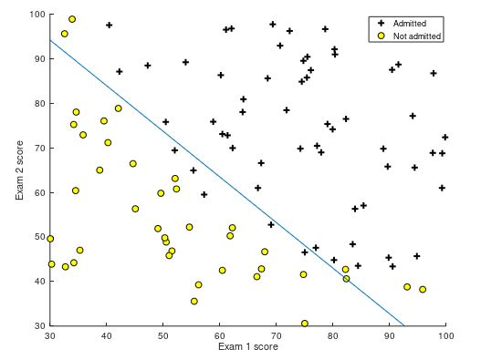

### Introduction
Machine Learning is "the field of study that gives computers the ability to learn without being explicitly programmed."  _- Arthur Samuel_

Machine Learning has a vast number of application in a number of fields, from computer science all the way to the medical field.

This project focuses on one specific application: image recognition.

### The purpose of the project
The aim of this project is to recognize handwritten digits (drawn via a mouse on a canvas).

### The stakeholders
This project is only a proof-of-concept. It is aimed at other individuals interested in machine learning, hoping that they might learn a thing or two from it.

### Requirements

1.	Python version 3.6.x is required.
2.	Used libraries (it is best to use latest version available): 
	- Kivy for the GUI
	- Numpy for handling numbers/matrices
	- Pillow for image processing
	- Tensorflow helps with the learning
	- matplotlib.pyplot for plots, visualization
3.	Recommended system specifications
	- Running GUI :
		- RAM : 1 GB
		- CPU : any AMD and Intel CPU made after the year 2008
		- GPU : any GPU capable of rendering a 800*600 window
	- Learning : 
		- RAM : 1.5 GB
		- CPU : any AMD and Intel CPU with at least 4 threads and made after the year 2008
		- GPU : Any Nvidia GPU capable of NVIDIA cuDNN v5.1 and NVIDIA CUDA 7.5

### Theoretical background

#### Model used
The machine learning model used for this project is: **logistic regression**. The reason why this model was used is because the given application requires classification.

This model, as any other machine learning model, tries to fit the dataset with a polynomial.

Given a dataset and classes A and B, this model can predict with a certain probability that a value X is in class A or class B.

#### The hypothesis function
The hypothesis function for this model is 

&nbsp;&nbsp;&nbsp;&nbsp;&nbsp;&nbsp;$h_\theta(x)=g(\theta^Tx)$

The only difference between this hypothesis function and the linear regression's hypothesis function is the use of the $g(z)=\frac{1}{1 + \mathrm{e}^{-z}}$ function.

The $g$ function, also known as the sigmoid or logistic function, makes it so that our output is in the $(0,1)$ interval. Otherwise we could not interpret our output as a probability.

#### The cost function
The cost function $J$ is 

&nbsp;&nbsp;&nbsp;&nbsp;&nbsp;&nbsp;$J(\theta)=-\frac{1}{m}*[\sum_{i=1}^{m} y^{(i)}log h_\theta(x ^{(i)}) + (1 - y^{(i)})log (1-h_\theta(x ^{(i)}))]$

The actual learning part of this algorithm is minimizing this cost function. We take the $\theta$ value at the function's minimum and use that for our hypothesis function.

#### Prediction
If the output of our hypothesis function is $>0.5$ then we predict 1, otherwise we predict 0. This means that we can only classify a given value into two classes.

#### Multiple classes
In our case we need to classify the values in 10 different classes {$0,1,2,3,4,5,6,7,8,9$}. To solve this, we will have 10 different logistic regression models, one for each digit. This means that we will have 10 different hypothesis functions. To decide in which class to classify the given handwritten digit, we need to evaluate it in all 10 of the hypothesis functions. The digit will be put into the class, where its evaluated value is the highest (it is the most probable that it belongs to that class)

$max(h_\theta^0(x),h_\theta^1(x),h_\theta^2(x),h_\theta^3(x),h_\theta^4(x),h_\theta^5(x),h_\theta^6(x),h_\theta^7(x),h_\theta^8(x),h_\theta^9(x))$

#### Illustrative example
_This example was taken from Andrew NG's Machine Learning Coursera course, which can be found [here](https://www.coursera.org/learn/machine-learning)_
We have a dataset with two features: exam1 score and exam2 score and a pass/fail label based on these exam scores. _See figure \ref{dataset}_

When we minimize the cost function $J$ the $\theta$ values we get we can use for the hyptothesis function $h$ to predict whether a student will pass, based on his two exam scores.
If we were to plot the hypothesis function, it would look as such _See figure \ref{fitted-dataset}_

Here we can clearly see that students with exam scores that would place them in the upper-right part of the plot, have a high chance of passing, while the students in the lower-left corner have a high chance of failing.

### Functional requirements
The script should be able to recognize a given handwritten digit with a reasonable accuracy.

### Non-functional requirements
The graphical user interface should be simple and easy to use. The following wireframe shows how the GUI was specified to look. _See figure \ref{wireframe}_

### Implementation

#### Logistic regression applied

##### Dataset
The dataset used for learning is the MNIST handwritten digits dataset. This dataset consists of handwritten digits and has a training set of 60,000 examples, and a test set of 10,000 examples.
It has the following characteristics:

- Each image has a resolution of 28*28 pixels.
- The images are bicolored.
- The database is available from [**this page**](http://yann.lecun.com/exdb/mnist/).

##### Featureset
In our case the featureset consists of 784 numbers arranged in a vector. This vector's size comes from the number of pixels on the input image, 28*28 = 784. The values are taken from each pixel’s brightness, then converted down from 0-255 to 0-1 for easier usage.

##### Weights

$Weights$ is the matrix which is set in the learning stage and used in the evaluation stage. It has 10 columns and 784 rows, each of these columns contain one number's featureset.

##### Machine Learning
- We used the functions implemented in the Tensorflow library
- Examples: nn.softmax(), add(), matmul(), reduce_mean() etc.
- For the optimizer we used the implemented GradientDescentOptimizer()

#### System diagram
Our system consists of python scripts. The following system diagram describes its operation. _See figure \ref{sys-diagram}_

#### Data formatting

Before feeding the algorithm, some enhancements are applied to the input image. The aim of these enhancements are to convert the input image to the required format for the algorithm, and to eliminate some of the problems which could arise when the user draws on the canvas. Some of these problems include:

- The user leaves the canvas blank.
- The user draws the number too small relative to the size of the canvas.
- The user draws the number with an offset to the center of the canvas.

The solution implemented for the problems above consists of applying anti-aliasing to the input image, trimming the image around the number with a small border, then resizing it to 28 by 28 pixels. Finally a matrix containing the single-channeled information about the pixels of the image is extracted to a text file, which will be processed by the recognition algorithm.
The functions handling these task are included in the formatting.py script.

#### Graphical User Interface
The task was to create a Graphical User Interface (GUI) based on the specified wireframe. The kivy python package was used for achieving this task. The GUI is written in python while also using the features of the kivy language. This script provides the skeleton for the whole project. This is where the other scripts are invoked (formatting.py and evaluate.py).

This GUI provides three separate canvases to draw on. By clicking the 'Save' button, the drawings on the canvases get converted to png image files and are save to the res folder

### User guide
After opening the application, it becomes possible to draw on each of the three canvases. _Figure \ref{gui-welcome}_

It is not obligatory to draw on every canvas.
After the drawing took place, the 'Save' button should be pushed. _Figure \ref{gui-save}_

After the 'Save' button was pushed, the result gets displayed in the lower-left corner. _Figure \ref{gui-res}_

